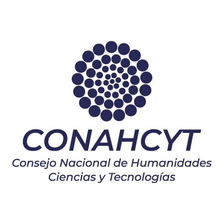

# Code repository for direct-then-inverse coupled artificial neural netwrok (DTINN) for the acoustic inverse scattering problem
This repository contains the dataset and scripts for direct and inverse neural networks proposed in the paper, which serve as a model for solving the inverse acoustic scattering problem. It also contains the necessary code for evaluating the performance of these networks.

The repository is associated with the following manuscript:

> _Meshir, J. D., Guerrero, E. A., & Palafox A. (2023). A Direct-Then-Inverse Coupled Artificial Neural Network for Acoustic Inverse Scattering._ 

You can find the scripts used to generate the figures presented in the paper in the [outputs](./outputs/README.md) folder.

## Repository structure

- [Coupled_NNs](./Coupled_NNs) : Contains the code for the direct and inverse neural networks  `CDINN` used in both the offline and online steps. It also includes the weights obtained during Direct NN (DNN) training in the offline step `Weigths_to_DNN` .
- [Notes](./Notes) : Provides Jupyter notebooks with explanations of the online step for solving the inverse scattering problem, along with testing cases. The data for these testing cases can be found in [Data_for_figures](./outputs/Data_for_figures)
- [outputs](./outputs) : Contains scripts that allow to reproduce the figures presented in the manuscript.

## Acknowledgments

We are grateful for the facilities granted to the project ``Modelación y pronóstico de fenómenos físicos mediante redes neuronales artificiales'' by the Center for Data Analysis and Supercomputing (CADS) of the University of Guadalajara, through the use of the Leo Atrox Supercomputer. J. D. M. thank to CONAHCYT for the postgraduated scholarship.

   &nbsp;&nbsp;&nbsp;&nbsp;&nbsp;&nbsp;&nbsp;&nbsp;
   &nbsp;&nbsp;&nbsp;&nbsp;
   &nbsp;&nbsp;&nbsp;&nbsp;

